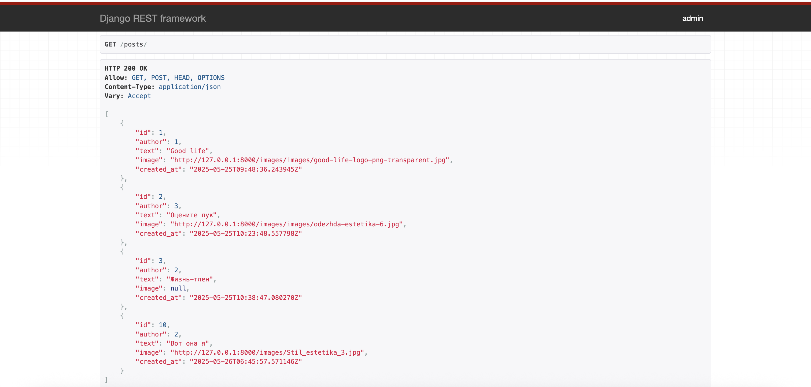
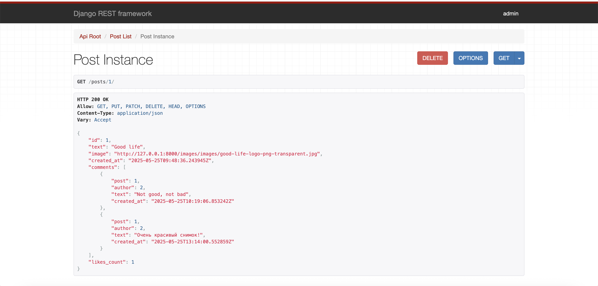

# 📸 Социальная сеть — backend-приложение для обмена фотографиями

## 📘 Описание проекта

Это backend-приложение социальной сети, реализованное на Django и Django REST Framework. Пользователи могут публиковать фотографии с подписями, комментировать посты других пользователей и ставить лайки. Система реализована с авторизацией и разграничением прав доступа.

---

## 🧩 Функциональность

- Регистрация и авторизация пользователей (через Django Admin)
- Создание, редактирование и удаление публикаций с изображениями
- Комментирование постов
- Лайки от пользователей
- Отображение комментариев и количества лайков у публикации
- Поддержка загрузки и отображения медиафайлов (фото)
- Ограничение прав: только автор может редактировать/удалять свои публикации

---

## 🚀 Запуск проекта локально

### 🔹 1. Клонировать репозиторий

```bash
git clone <URL>
cd social_network
```
### 🔹 2. Создать виртуальное окружение и активировать его

```bash
python -m venv venv
source venv/bin/activate      # для Linux/macOS
venv\Scripts\activate         # для Windows
```

### 🔹 3. Установить зависимости
```bash
pip install -r requirements.txt
```

### 🔹 4. Настроить подключение к PostgreSQL
Откройте файл `social_network/settings.py` и укажите параметры подключения:

```
DATABASES = {
    'default': {
        'ENGINE': 'django.db.backends.postgresql',
        'NAME': 'your_db_name',
        'USER': 'your_db_user',
        'PASSWORD': 'your_password',
        'HOST': 'localhost',
        'PORT': '5432',
    }
}
```

### 🔹5. Применить миграции

```python
python manage.py migrate
```

### 🔹 6. Создать суперпользователя
```python
python manage.py createsuperuser
```

### 🔹 7. Запустить сервер
```bash
python manage.py runserver
```
Открой http://127.0.0.1:8000 в браузере.

### 🔹 8. Работа с изображениями
Загружаемые изображения сохраняются в папку images/.
Настройки в settings.py:
```
MEDIA_URL = '/images/'
MEDIA_ROOT = os.path.join(BASE_DIR, 'images')
```
## 🔍 Примеры API

### 📄 Получить список публикаций
```http
GET /posts/
```
### 📄 Получить одну публикацию. 
Возвращает полную информацию о конкретной публикации, включая комментарии и количество лайков.
```http
GET /posts/<id>/
```
### 📝 Создать публикацию (авторизация обязательна)
```http
POST /posts/
```
Пример тела запроса (multipart/form-data):
```
{
  text: Новый пост
  image: файл изображения
}
```

### 💬 Оставить комментарий к публикации
```http
POST /comments/
```
Пример тела запроса:
```
{
  "post": 1,
  "text": "Крутая фотография!"
}
```

### ❤️ Поставить лайк на публикацию
```http
POST /likes/
```
Пример тела запроса:
```
{
  "post": 1
}
```

## 📦 Пример ответа на GET /posts/1/
```
{
    "id": 1,
    "text": "Good life",
    "image": "http://127.0.0.1:8000/images/images/good-life-logo-png-transparent.jpg",
    "created_at": "2025-05-25T09:48:36.243945Z",
    "comments": [
        {
            "post": 1,
            "author": 2,
            "text": "Not good, not bad",
            "created_at": "2025-05-25T10:19:06.853242Z"
        },
        {
            "post": 1,
            "author": 2,
            "text": "Очень красивый снимок!",
            "created_at": "2025-05-25T13:14:00.552859Z"
        }
    ],
    "likes_count": 1
}
```



